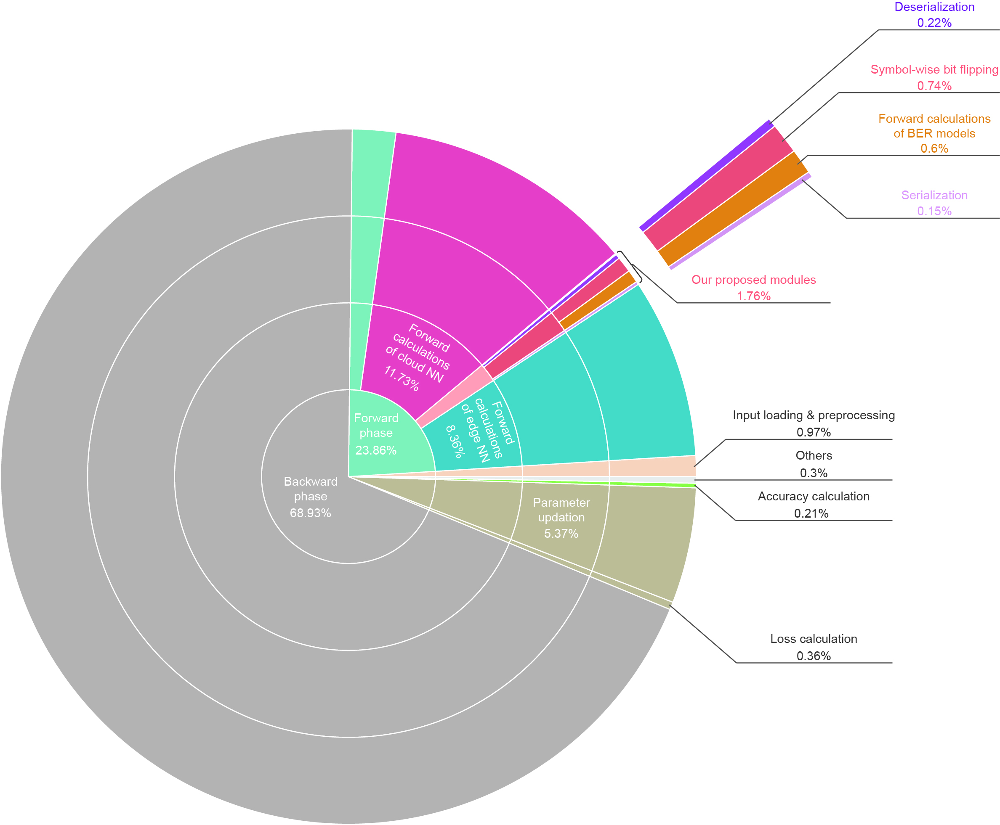

# Communication-aware training

## Training cost
### Source file is [Here](train_logs)

### training cost visualization:



## Environment
Windows/Linux + CPU/GPU + python3.8

## Code Structure
>``` 
> Communication-aware-training
>   -- asset  
>   -- checkpoints                              // Automatically generated
>   -- data                                     // Automatically generated
>       -- channel                              // BER data
>   -- src                                      // Source code
>       -- channel_simulate
>           -- channel_model
>               -- __init__.py
>               -- fwgn_np.py                   // Clarke model simulation
>           -- link_simulation_np
>               -- __init__.py
>               -- serial_parallel_np.py        // Serial-parallel and Parallel-serial conversions
>           -- link_simulation_torch
>               -- __init__.py
>               -- communication_tools.py
>               -- simulation.py                // Link-level simulation of AIMC-based communication
>           -- differentiable_flip.py           // Differentiable bit flipping
>           -- differentiable_serialize.py      // Differentiable serialization and deserialization
>           -- fitting.py                       // Fit the BER model
>       -- dataset                      
>           -- __init__.py
>           -- image_net_100.py                 // Generate ImageNet-100 Dataset
>           -- image_net_loader.py              // Load ImageNet (ImageNet-100) Dataset
>       -- hybrid_model                         // CNN that can be quantized to arbitrary precisions
>           -- __init__.py          
>           -- hybrid_cnn.py                    // ResNet that support arbitrary-precision quantization
>           -- modules.py                       // Modules: QConv2d, QReLU, QResidualBlock, QBottleneck
>       -- quantize                             // Computational graph optimization and Quantization
>           -- graph_optimize                   
>             -- __init__.py
>             -- fold_fusion.py                 // BN-fold
>           -- post_train_q
>             -- __init__.py
>             -- aicq.py                        // Post-training quantization
>           -- q_aware_train
>             -- __init__.py
>             -- dsq.py                         // Quantization-aware training
>           __init__.py
>        __init__.py
>   -- train_logs                               // Training logs
>   -- dist_train_image_net.py                  // Distributed data parallel training and testing
>   -- main.py
>   -- README.md                                // This file
>   -- requirements.txt
>   -- resnet50_config.yaml                     // Configuration 1; Involving model structure, quantization scheme, ...
>   -- train_config.yaml                        // Configuration 2; Involving wireless channel settings, trainig hyperparameters, ...
>```

## Requirements
Refer to [requirement](requirements.txt)
